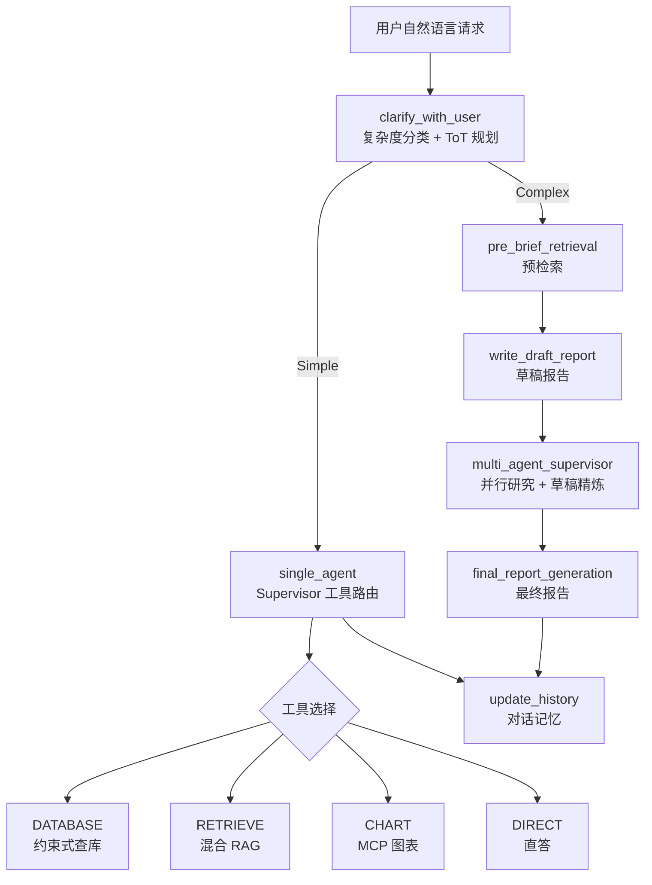

# 面向储能电池故障分析的 Deep Research 多智能体系统 — 论文构思

> 基于 Deep_Research-main-v0326 项目整理  
> 适用：背景、方法、结果三大部分；方法部分为重点

---

## 摘要（可选）

本文提出一种面向储能电池运维场景的 **"结构化数据 + 非结构化知识 + 多智能体推理"** 融合框架。系统基于 LangGraph 构建有状态 Agent 工作流，通过任务复杂度自适应路由、约束式自然语言查库、图文一体混合 RAG 与分层 Multi-Agent 协作，实现从实时数据查询、知识检索到深度诊断报告生成的全链路智能分析。

**关键词：** 储能电池；故障诊断；多智能体；RAG；Text-to-SQL；LangGraph

---

## 1. 背景（Background）

### 1.1 问题背景

储能电站运维中，故障诊断与排查同时依赖两类信息源：

1. **结构化运行数据**
   - 告警事件（`alarm_event`）
   - 设备时序数据（`box_data` / `cluster_data` / `bmu_data`）
   - 诊断结果表（内阻异常、ISC 评分、容量不一致等）

2. **非结构化领域知识**
   - 失效分析流程、标准规范、历史案例
   - 大量流程图、SEM 形貌图、波形图等图示证据

传统方式依赖运维人员人工查库、翻阅文档，效率低、经验依赖强，难以应对复杂、跨文档的综合诊断需求。

### 1.2 技术挑战

| 挑战 | 具体表现 | 本项目应对策略 |
|------|----------|----------------|
| LLM 直接生成 SQL 易幻觉 | 表名/字段名错误、时间条件不合理 | LLM 做查询规划，程序层白名单约束拼 SQL |
| 纯文本 RAG 丢失图示证据 | 流程图、形貌图等关键信息无法召回 | 图文一体 chunk：文本召回 + 图片 metadata 回传 |
| 简单查数 vs 深度诊断需求差异大 | 全走重型链路延迟高、成本高 | 复杂度分类 + Simple / Deep 双路径 |
| 多源证据难以整合 | RAG、DB、图表结果分散 | Multi-Agent Supervisor + 草稿迭代 + 最终报告合成 |

### 1.3 相关工作

- **检索增强生成（RAG）**：Dense Retrieval、Hybrid Retrieval（Dense + Sparse）
- **智能体工作流**：LangGraph、Supervisor-Worker 架构、Tool-use Agent
- **自然语言查库（NL2SQL / NL2Query）**：Schema-grounded、Plan-then-Execute
- **领域智能助手**：工业运维、故障诊断、储能 BMS 场景

### 1.4 本文贡献（建议表述）

1. 提出面向电池运维的 **复杂度自适应双路径 Agent 架构**（Simple 快速响应 / Deep 深度研究）。
2. 设计 **Schema 约束的自然语言查库流水线**，兼顾灵活性与执行安全性。
3. 实现 **图文一体混合 RAG**，支持故障分析场景下的图示证据回传。
4. 构建可观测、可落盘的端到端诊断报告生成系统，并在真实业务数据与知识库上验证。

---

## 2. 方法（Methods）— 核心部分

### 2.1 系统总体架构

系统基于 **LangGraph StateGraph** 构建，共享状态 `AgentState` 贯穿全流程，各节点输出可落盘至 `log/thinkdepth_run_*`，支持运行日志、节点事件与最终报告的可观测性。

#### 2.1.1 总体流程



#### 2.1.2 核心模块与代码对应

| 模块 | 主要文件 | 功能 |
|------|----------|------|
| 深度研究主流程 | `research_agent_full.py` | 图构建、路由、最终报告 |
| 复杂度分类与预检索 | `research_agent_scope.py` | clarify、pre_brief、草稿 |
| 简单任务 Supervisor | `single_agent_supervisor.py` | 四路工具路由 |
| Multi-Agent Supervisor | `multi_agent_supervisor.py` | 研究计划与并行调度 |
| Researcher 子 Agent | `research_agent.py` | 检索-决策循环 |
| 数据库分析 | `research_agent_analyze.py` | 约束式 NL 查库 |
| 混合 RAG | `local_db.py` | Chroma + BM25 融合 |
| 图表生成 | `research_agent_draw.py` | MCP Chart Server |
| 知识库构建 | `step1_build_konwledge.py` | 文档解析与切分 |

#### 2.1.3 技术栈

- **编排框架**：LangGraph
- **大语言模型**：Gemini 系列（如 gemini-2.5-flash）
- **Embedding**：Qwen3-Embedding-4B
- **向量库**：Chroma
- **稀疏检索**：BM25（rank_bm25 + jieba 分词）
- **图表服务**：MCP Chart Server
- **访问方式**：Web UI（FastAPI + Gradio）、HTTP API

---

### 2.2 任务复杂度分类与自适应路由

**对应节点：** `clarify_with_user` → `route_after_retrieval`

#### 2.2.1 设计思想

使用 LLM 作为 **Tree-of-Thoughts (ToT) 规划器**，在任务入口处同时完成：

1. **复杂度判定**：Simple（单智能体） vs Complex（多智能体深度研究）
2. **执行策略规划**：Simple 路径输出 ToT 思维链，指导下游 Supervisor

#### 2.2.2 分类规则

**Simple 任务（`need_deepresearch = false`）**

- 明确查库：含具体设备 ID 的状态/告警/时序查询
- 模糊查库：表达"系统状态/运行情况/有没有告警"等运维意图，但缺少 ID（由下游 `db_intent_router` 反问候选场景）
- 数据可视化：画图、趋势图、柱状图等
- 单次知识检索：标准流程、概念解释、故障原因列举
- 直答/闲聊

**Complex 任务（`need_deepresearch = true`）**

- 基于具体现象的深度推理诊断（无明确 ID，需多轮检索与综合）
- 跨多个非结构化文档的综合研判
- 需多步推理才能得出结论的故障根因分析

#### 2.2.3 关键过滤规则（论文可强调）

| 类型 | 示例 | 判定 |
|------|------|------|
| 知识列举 | "电压异常故障有哪几种潜在原因？" | Simple |
| 标准流程 | "耐湿热实验有哪些步骤？" | Simple |
| 现象推理 | "某电芯充电<80%SOC 电压最低，放电全程最高，这是什么故障？" | Complex |

#### 2.2.4 输出状态

- `is_complex_task`：路由至 Simple 或 Complex 路径
- `current_tot`：Simple 路径的思维链规划
- `task_type = "deep_research"`：Complex 路径前端展示标记

---

### 2.3 简单任务路径：Supervisor 工具路由

**对应模块：** `single_agent_supervisor.py`

#### 2.3.1 Supervisor 职责

根据用户请求 + ToT 规划，输出结构化 JSON：

```json
{
  "next_action": "DATABASE | RETRIEVE | CHART | DIRECT",
  "task_type": "direct | kb_retrieval | station_device_td | alerting | troubleshooting",
  "reason": "...",
  "params": { }
}
```

#### 2.3.2 四类业务场景

| task_type | 典型问题 | 主要数据表 |
|-----------|----------|------------|
| `station_device_td` | 设备时序、趋势、运行状态 | `box_data`, `cluster_data`, `bmu_data` |
| `alerting` | 告警摘要、严重度、重复模式 | `alarm_event`, `volt_temp_abnormal_result` |
| `troubleshooting` | 内阻/ISC/容量异常、根因线索 | `dcr_abnormal_cells`, `isc_score_result`, `capacity_inconsistent_cells` |
| `kb_retrieval` | 流程、原理、案例、标准规范 | 本地知识库 |

#### 2.3.3 路由优先级

1. DATABASE（含明确/模糊查库）
2. CHART（数据已在上下文中）
3. RETRIEVE（概念性知识）
4. DIRECT（闲聊、元问答、上下文已足够）

#### 2.3.4 工程保障

- LLM JSON 输出 + 后端规则兜底（`_infer_task_type`）
- 支持 **"先查库再画图"** 链式执行（`chart_after_db`）
- 模糊查库时 params 留空，由 `db_intent_router` 提供 5 个候选场景供用户选择

#### 2.3.5 简单路径回答生成

`solve_simple_task` 融合 DB 结果、RAG 证据、图表上下文，以专家诊断 prompt 生成结构化回复：

- 第一部分：诊断结论（一句话）
- 第二部分：详细分析（数据洞察 / 机理分析）
- 第三部分：处置建议（具体运维动作）

---

### 2.4 深度研究路径：Multi-Agent 协作

**对应模块：** `research_agent_full.py` + `multi_agent_supervisor.py` + `research_agent.py`

#### 2.4.1 流程步骤

| 步骤 | 节点 | 功能 |
|------|------|------|
| 1 | `pre_brief_retrieval` | 生成案例导向检索主题，从 plan 库预检索 |
| 2 | `write_draft_report` | 基于预检索证据撰写初稿 |
| 3 | `supervisor_subgraph` | Supervisor 调度并行 Researcher |
| 4 | `final_report_generation` | 融合 findings + draft + 历史，流式生成最终报告 |
| 5 | `update_history` | 更新对话记忆 |

#### 2.4.2 Supervisor-Researcher 架构

**Supervisor 工具集：**

- `ConductResearch`：派发研究子任务（最大并行数 = 2）
- `ResearchComplete`：终止研究并进入报告阶段
- `think_tool`：中间思考
- `refine_draft_report`：精炼草稿

**Researcher 子图（`research_agent.py`）：**

```
START → decision_node → [tool_node ↔ decision_node] → compress_research → END
```

- `decision_node`：LLM 决策是否继续检索
- `tool_node`：调用 `local_search` 等工具
- `compress_research`：压缩检索结果

#### 2.4.3 最终报告生成

`final_report_generation` 输入：

- `research_brief`：研究简报
- `findings`：各 Researcher 汇总 notes
- `draft_report`：草稿
- `user_request` + 最近 5 轮对话历史

输出：流式生成的结构化诊断报告（含引用与图示引用）。

---

### 2.5 图文一体混合 RAG

**对应模块：** `step1_build_konwledge.py` + `local_db.py` + `readme_RAG.md`

#### 2.5.1 设计动机

纯文本 RAG 在故障分析场景下存在明显短板：关键证据常存在于流程图、形貌图、波形图中。本项目采用 **"文本负责召回，图片随 chunk 回传"** 的策略。

#### 2.5.2 离线构建（两段式）

**Step1：解析、切分、图文绑定**

1. MinerU 解析文档（Office/文本转 PDF）
2. 按目录策略切分（h1 标题 / 空行 / 默认策略）
3. 提取 Markdown 图片语法，清洗文本得到 `cleaned_content`
4. 过滤：`cleaned_content` 非空且 token ≥ 阈值（默认 25）
5. 写入 `kv_store_text_chunks.json`，metadata 含 `image_paths`
6. 图片归档至 `rag_data/all/images/<doc_id>/`

**Step2.5：向量化写入 Chroma**

- 对 chunk 文本调用 Embedding API
- 批处理 + 限速 + 重试
- 写入 Chroma 持久化目录

#### 2.5.3 双库设计

| 知识库 | 路径 | 用途 |
|--------|------|------|
| 主库 | `rag_data/all` | 通用知识检索 |
| 计划库 | `rag_data/plan` | 预检索、深度研究案例 |

#### 2.5.4 在线混合检索

**Dense 检索：** Chroma 向量相似度（距离转相似度：`1 - dist`）

**Sparse 检索：** BM25（jieba 中文分词）

**融合公式：**

$$
score(d) = \alpha \cdot \widehat{BM25}(d) + (1 - \alpha) \cdot \widehat{Emb}(d)
$$

- $\widehat{\cdot}$：min-max 归一化
- $\alpha$：`_BM25_ALPHA` 超参数
- 取 Top-K 结果，metadata 含 `image_paths` 供前端展示

#### 2.5.5 核心设计原则

- 向量 **仅嵌入清洗后文本**，避免图片路径污染语义
- 图片作为 chunk 级 metadata，检索命中后一并回传
- 最终回答阶段可结合多模态能力读取图片

---

### 2.6 约束式自然语言数据库查询

**对应模块：** `research_agent_analyze.py` + `readmeDB.md`

> 这是方法部分最具论文价值的模块之一。

#### 2.6.1 设计原则

**LLM 负责理解与规划，程序负责约束与执行。**

避免 LLM 直接输出 SQL 带来的：表名幻觉、字段错误、route 与表不匹配、limit/排序越界等问题。

#### 2.6.2 端到端流水线


| 阶段 | 执行者 | 输入/输出 |
|------|--------|-----------|
| 1. 场景路由 | LLM#1 | 用户问题 → `route` + 设备/时间范围 |
| 2. 查询规划 | LLM#2 | route + 问题 → 结构化 `plans[]` |
| 3. 计划清洗 | 程序 | plans → 合法 plans（白名单校验） |
| 4. SQL 构建 | 程序 | plans → 可执行 SQL |
| 5. 接口执行 | 程序 | SQL → 行式结果 JSON |
| 6. 证据融合 | LLM#3 | 结果 JSON → `db_evidence_bundle` |
| 7. 回答生成 | LLM | evidence + 上下文 → 中文结论 |

#### 2.6.3 三类业务 Route

| Route | 目标 | 主要表 |
|-------|------|--------|
| `alerting` | 异常总览、告警摘要 | `alarm_event`, `volt_temp_abnormal_result` |
| `troubleshooting` | 根因排查、诊断线索 | `dcr_abnormal_cells`, `isc_score_result`, `capacity_inconsistent_cells` |
| `station_device_td` | 设备时序、趋势分析 | `box_data`, `cluster_data`, `bmu_data` |

#### 2.6.4 查询规划结构（plans[]）

每个 plan 包含：

- `table`：目标表
- `select_fields`：查询字段
- `filters`：过滤条件
- `time_filter`：时间范围
- `order_by` / `order_desc`：排序
- `limit`：返回条数上限

#### 2.6.5 安全机制

- `TABLE_SCHEMAS` 白名单约束表与字段
- route-table allowlist 限制 route 可访问表范围
- `DB_FIELD_ALIASES` 字段别名自动映射
- 删除不在 schema 中的非法字段
- `limit` 安全夹紧（建议 1–200）
- 信息不足时输出 `clarification_needed`，反问候选场景

#### 2.6.6 与纯 Text-to-SQL 对比

| 方案 | 优点 | 缺点 |
|------|------|------|
| LLM 直接生成 SQL | 灵活、端到端 | 幻觉多、不可控、难观测 |
| **本项目 Plan + Sanitize + Build** | 稳定、可降级、全链路日志 | 需预定义 schema 与 route |

---

### 2.7 可视化与报告合成

#### 2.7.1 图表生成

- **服务：** MCP Chart Server
- **触发：** Supervisor 路由 CHART，或 DATABASE 后链式 `chart_after_db`
- **参数：** `chart_type`, `x_field`, `y_field`, `title`
- **支持类型：** 折线图、柱状图、饼图、面积图等

#### 2.7.2 报告合成策略

| 路径 | 模块 | 特点 |
|------|------|------|
| Simple | `solve_simple_task` | 专家诊断风格，结论先行 |
| Complex | `final_report_generation` | 融合多轮研究 findings + 草稿 + 历史 |

#### 2.7.3 对话记忆

- `update_history_node` 统一更新 `history`
- 支持多轮上下文，最近 k 轮注入 prompt

---

### 2.8 方法部分建议章节结构

```
3. System Overview
3.1 Task Complexity Classification and Adaptive Routing
3.2 Single-Agent Fast Path with Tool Routing
3.3 Multi-Agent Deep Research Pipeline
3.4 Image-Text Integrated Hybrid Retrieval
3.5 Schema-Constrained Natural Language Database Querying
3.6 Evidence Fusion and Report Generation
3.7 Implementation Details
    - LangGraph 状态图
    - LLM / Embedding 配置
    - 可观测性与日志落盘
```

---

## 3. 结果（Results）

### 3.1 实验设置

#### 3.1.1 数据与知识库

- **结构化数据：** 电池告警、时序、诊断表（具体规模需补充：表数量、记录数、时间跨度）
- **非结构化知识库：**
  - chunk 数量（`kv_store_text_chunks.json`）
  - 图片数量（`rag_data/all/images`）
  - 文档类型（失效分析流程、标准规范、案例等）

#### 3.1.2 对比基线

| 基线 | 描述 |
|------|------|
| Pure LLM | 无 RAG、无 DB，纯大模型回答 |
| RAG-only | 仅混合 RAG，无 Agent 编排 |
| Direct SQL | LLM 直接生成 SQL，无 schema 约束 |
| Always-Deep | 去掉复杂度路由，全部走 Multi-Agent |

#### 3.1.3 实现环境

- Python 3.11+
- Gemini 2.5-flash + Qwen3-Embedding-4B
- Chroma + BM25
- MCP Chart Server

---

### 3.2 评价指标

| 维度 | 指标 | 说明 |
|------|------|------|
| 查库准确性 | SQL 可执行率 | 生成 SQL 能否成功执行 |
| | 字段正确率 | select/filter 字段是否符合意图 |
| | 结果一致率 | 与人工标注查询结果的一致性 |
| 检索质量 | Recall@K / MRR | 相关文档召回 |
| | 含图证据召回率 | 关键图示是否被召回 |
| 回答质量 | 专家打分 | 准确性、完整性、可行动性（1–5 分） |
| 系统效率 | 端到端延迟 | Simple vs Deep 路径对比 |
| | Token 消耗 | 各路径平均 token |
| 路由准确性 | 复杂度分类准确率 | Simple/Complex 判定 |
| | Supervisor 路由准确率 | DATABASE/RETRIEVE/CHART/DIRECT |

---

### 3.3 案例研究（Case Study）

#### Case 1：深度诊断 + 图文证据（Complex 路径）

- **问题：** 电芯容量衰减过快的原因分析
- **路径：** Complex → pre_brief → draft → multi_agent → final_report
- **证据：** RAG 召回失效分析流程 + SEM 正负极形貌图
- **输出示例：**
  - 正极形貌保持良好，失效主因不在正极
  - 负极表面沉积物、SEI 过度生长
  - 结合流程图给出有损分析 SOP
- **参考报告：** `reports/Report_20260430_112037.md`

#### Case 2：实时告警查询（Simple + DATABASE + alerting）

- **问题：** 某站点某 pack 最近告警及严重度
- **路径：** Simple → Supervisor(DATABASE) → retrieve_battery_node
- **输出：** 告警列表、严重度排序、重复模式摘要

#### Case 3：时序趋势 + 可视化（Simple + DATABASE + CHART）

- **问题：** 某 cluster 最近 24h 电流/功率趋势，并画图
- **路径：** Simple → DATABASE（chart_after_db=true）→ MCP Chart
- **输出：** 时序数据表格 + 折线图 + 趋势解读

#### Case 4：模糊运维意图（Simple + DATABASE + 反问）

- **问题：** "现在系统状态如何？"（无设备 ID）
- **路径：** Simple → DATABASE（params 为空）→ db_intent_router 反问候选
- **输出：** 5 个候选场景供用户选择（设备实时/异常预警/内阻/ISC/容量）

---

### 3.4 消融实验（Ablation）

| 实验 | 改动 | 预期影响 |
|------|------|----------|
| w/o BM25 | 仅 Dense RAG | 专有名词、编号类查询召回下降 |
| w/o Schema 约束 | LLM 直接写 SQL | 可执行率下降、字段错误增多 |
| w/o 复杂度路由 | 全部走 Deep | 延迟与 token 显著上升 |
| w/o 图文 metadata | 仅文本 RAG | 流程图/形貌图类问题回答质量下降 |
| w/o ToT 规划 | Simple 路径无思维链 | Supervisor 路由准确率可能下降 |

---

### 3.5 结果展示建议

1. **主表：** 各基线在查库准确率、回答质量、延迟上的对比
2. **消融表：** 各模块移除后的性能变化
3. **案例截图：** Web UI 对话、图表、含图证据报告
4. **路由统计：** Simple/Complex 分布、四类 task_type 占比
5. **可观测性示例：** `log/thinkdepth_run_*` 节点事件时间线

---

## 4. 讨论与展望（可选）

### 4.1 局限性

- Schema 与 route 需人工维护，新表接入有工程成本
- Multi-Agent 路径迭代轮次有限（当前 max_iterations=1），复杂问题可能研究不充分
- 图片证据依赖 chunk 切分质量，过短 chunk 可能被过滤

### 4.2 未来工作

- 自动 schema 发现与 route 扩展
- 多模态 Embedding 直接检索图片
- 人工反馈（RLHF / 偏好学习）优化报告质量
- 更大规模基准测试与开源评测集

---

## 5. 附录

### 5.1 项目结构速查

```
deep_research/
├── research_agent_full.py       # 深度研究主流程
├── single_agent_supervisor.py   # 简单任务 Supervisor
├── multi_agent_supervisor.py    # 多智能体监督器
├── research_agent_scope.py      # 澄清、预检索、草稿
├── research_agent_analyze.py    # 数据库分析
├── research_agent_draw.py       # 图表生成
├── research_agent.py            # Researcher 子 Agent
├── local_db.py                  # 混合 RAG
├── prompts.py                   # 全量 Prompt
└── state_scope.py               # 共享状态定义

rag_data/
├── all/                         # 主知识库
└── plan/                        # 计划知识库
```

### 5.2 关键 Prompt 清单

| Prompt | 用途 |
|--------|------|
| `classify_complexity_instructions` | 复杂度分类 + ToT |
| `supervisor_system_prompt` | Simple 路径工具路由 |
| `db_intent_router_prompt` | DB 场景路由 |
| `lead_researcher_with_multiple_steps_...` | Multi-Agent Supervisor |
| `final_report_generation_with_helpfulness_...` | 最终报告生成 |

### 5.3 写作检查清单

- [ ] 总架构图（Mermaid 或 Visio）
- [ ] Simple vs Complex 对比表
- [ ] DB 流水线流程图
- [ ] RAG 离线/在线流程图
- [ ] 至少 3 个 Case Study
- [ ] 基线 + 消融实验设计
- [ ] 评价指标定义清晰

---

*文档版本：v1.0 | 基于 Deep_Research-main-v0326 项目整理*
